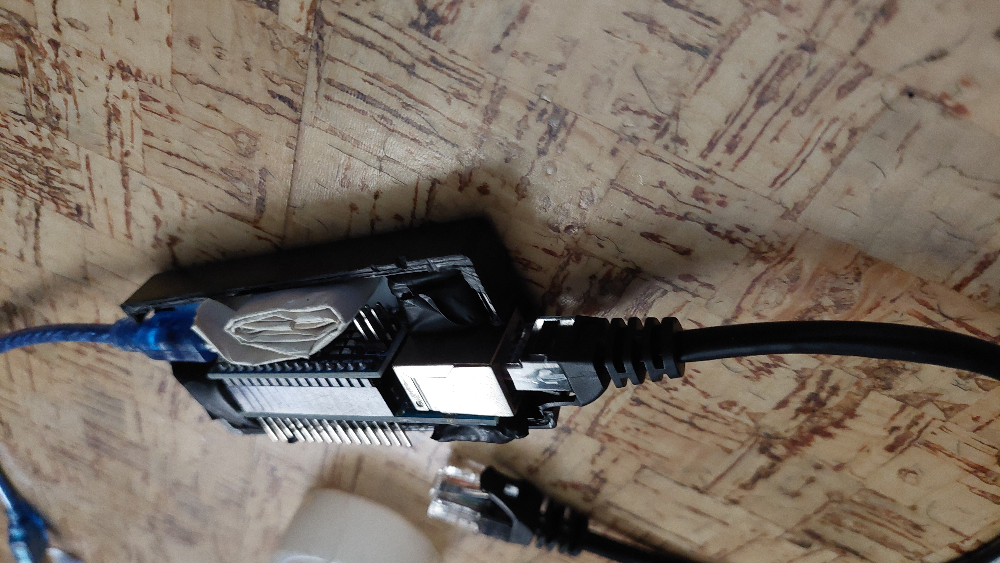

# ArduinoNano-ARP
Disconnect all users from WiFi

## Necessary Tools
- Arduino Nano
- ENC28J60 (NO OTHER TYPES ! it will NOT Working)
## Set Up (Take a look on Images down)
- Plug it together & make sure Arduino nano USB port is connected on other site on ENC28J60
- Now connect LAN Cable to ENC Module and Power Arduino Nano with USB and some powerbank
- Wait for it load (depends on router and qualitty of both devices)
- Thats it & all.

## Some Images
- 📦 All in the plastic box 
- Basically Fake 🔥 🧱 for fooling others to dont unplug it from 📌target router📌


- LAN Cable connector 


- 📝 Inside the box with filled using paper



# ! WARNING !
- THIS IS AGGRESSIVE & HARMFUL ATTACK !
- ! BY USING THIS GUIDE OR CODE YOU ARE RESPONSIBLE BY YOURSELF FOR ALL DAMAGES OR OTHER BAD ACTIVITIY !
- ! TEST ONLY WITH OWNER PERMISSION !

# Give me star and Spacehuhn too.

## Links
- Spacehuhn
```
https://github.com/spacehuhn
```
- Me
```
https://github.com/Fattcat
```
