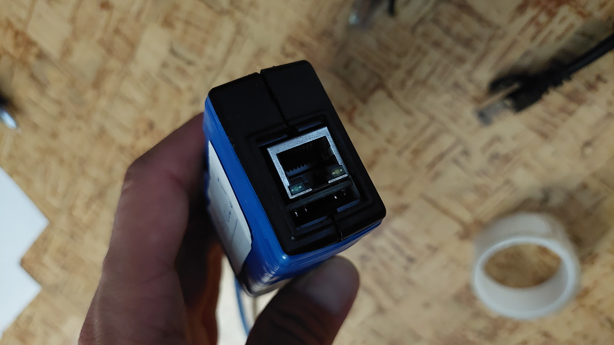

# ArduinoNano-ARP
Disconnect all users from WiFi

## Necessary Tools
- Arduino Nano
- ENC28J60 (NO OTHER TYPES ! it will NOT Working)
## Set Up (Take a look on Images down)
- Plug it to gether & make sure Arduino nano USB port is connected on other site on ENC28J60
- Now connect LAN Cable to ENC Module and Power Arduino Nano with USB and some powerbank
- Wait for it load (depends on router and qualitty of both devices)
- Thats it & all.

## Some Images
- 📦 All in the plastic box 🔥🧱

- LAN Cable connector 

- 📝 Inside the box with filled using paper

- 

# Give me star and Spacehuhn too.

## Links
- Spacehuhn
```
https://github.com/spacehuhn
```
- Me
```
https://github.com/Fattcat
```
